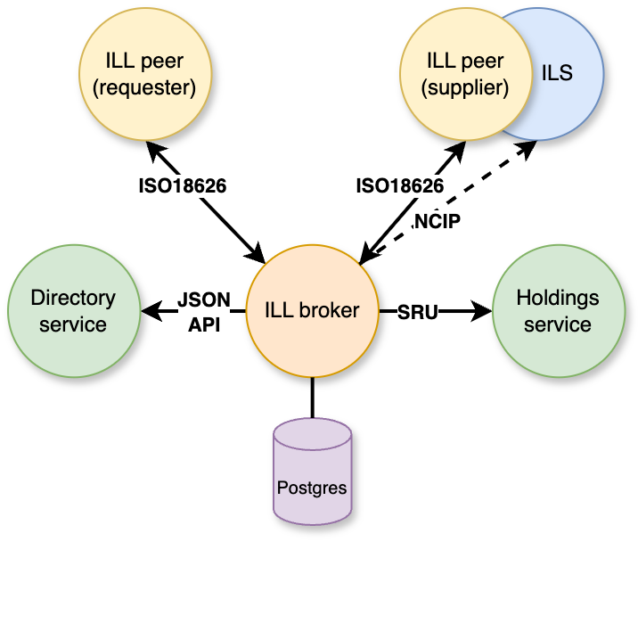

# CrossLink Inter-Library Loan Platform

CrossLink project provides software services for the implementation of Inter-Library Loan (ILL) solutions. It was developed by Index Data, led by the IDS Project, and supported by the Institute of Museum and Library Services.

See individual components docs for details:

* [broker](broker/README.md): ISO18626 transaction broker
* [illmock](illmock/README.md): ISO18626 and SRU mocking service

# Project goals and architecture

The CrossLink project improves the efficiency and reduces the cost of resource sharing by fostering interoperability between library systems, including facilitating cross-consortial lending. It focuses on promoting technology that allows libraries to engage in consortial resource sharing while maintaining flexible local ILL workflows. For all integration points, the project leverages various library IT standards, including ISO18626, SRU (Search/Retrieve via URL), and NCIP (NISO Circulation Interchange Protocol). The project improves the current state by encouraging vendors to implement new functionality and by providing middleware that helps libraries utilize existing systems more effectively. A central component is a broker system that receives requests, identifies suitable suppliers, and routes requests to them, supporting a wide range of automation and service levels for resource sharing. Another key component is an ILL mock service. This service provides a way to test and verify the compliance of existing systems with ILL standards.

See the diagram below for an illustration of the platform's architecture:


*Figure 1: High-level architecture of the CrossLink platform showing component interactions*

## Hosted development environment

The `broker` is available at: https://broker.crosslink-dev.indexdata.com.

The `illmock` and the submit form is available at: https://illmock.crosslink-dev.indexdata.com/form.

## Running Docker images

All containers and Helm charts from this repository are published to the GitHub Container Registry,
`ghcr.io/indexdata`.

Run the container for a given application in this repository with (replace `{appName}` with e.g. `crosslink-broker`):

```
docker run ghcr.io/indexdata/{appName}:main
```

Only `main` tag is available.

If you're running on a platform that is not `linux/amd64`, make sure to pass the `--platform linux/amd64` flag to `docker pull/run`.
Only `amd64` images are published from this repository.

# Deploying on Kubernetes

When deploying on Kubernetes, use the Helm charts published from this repo under `ghcr.io/indexdata/charts`.

You can install the chart to your current cluster context/namespace with (replace `{releaseName}` and `{appName}` with appropriate values):

```
helm install {releaseName} oci://ghcr.io/indexdata/charts/{appName} --devel
```

The flag `--devel` is required as only main snapshot containers and charts are published.

You can configure environment variables during `helm install` with:

```
--set env.{PARAMETER}={value}
```

Charts use the `LoadBalancer` service type by default, you can change this during installation:

```
--set service.type=ClusterIP
```

For any installation application DB user must have privileges to create schema. 
Database migrations will create and update all required tables and other objects 
inside the selected schema.