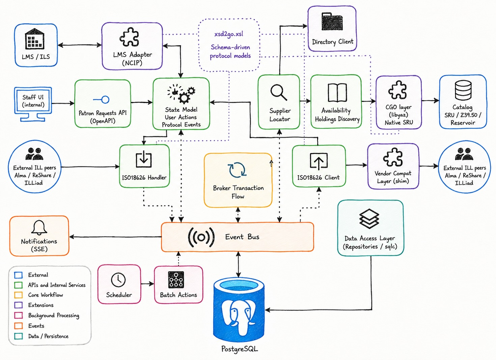
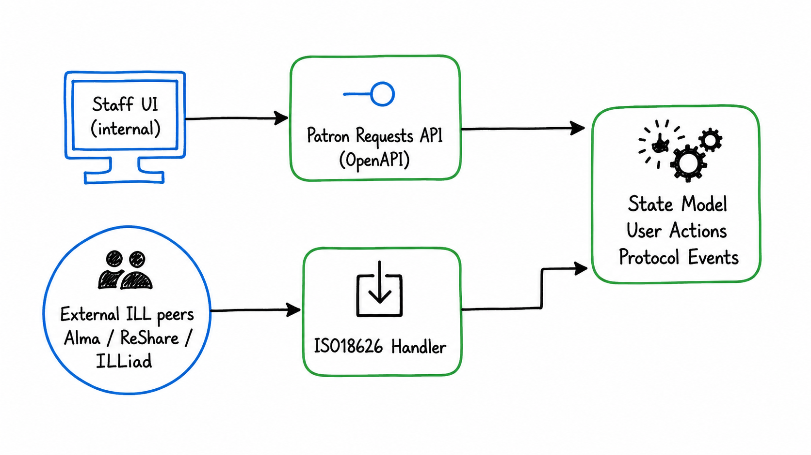
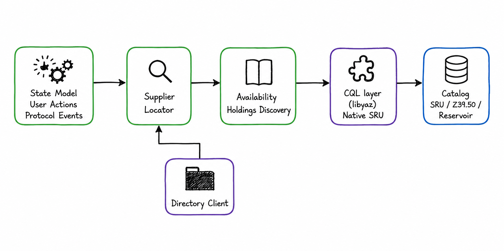
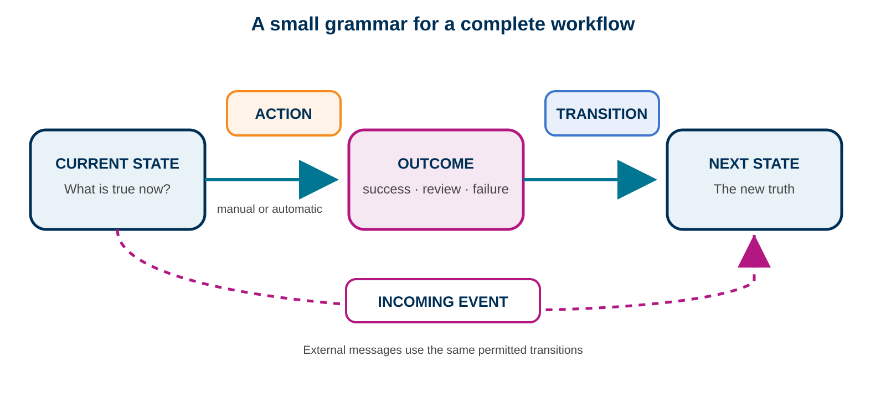
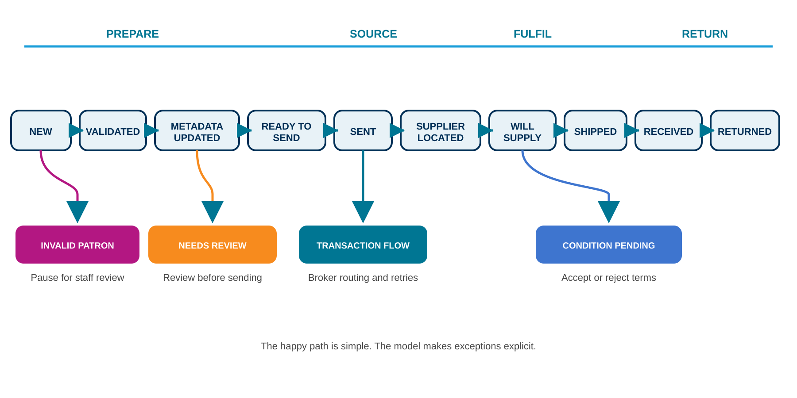
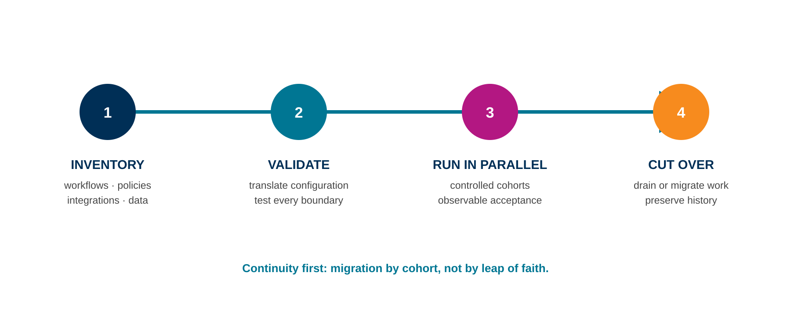

# From broker to platform

| WolfCON 2025 | WolfCON 2026 |
|---|---|
| Standards-based ILL broker | Complete ReShare workflow platform |
| Connect external peers | Native borrowing and lending |
| Route and observe transactions | Model and operate the lifecycle |

New: Patron Requests API · NCIP · explicit state model · live UI events · scheduling

::: notes
Last year we presented CrossLink as a standards-based broker. This year the broker has become the foundation for ReShare's own borrowing and lending workflows. The key addition is not simply another API; workflow itself is now explicit.
:::

# ReShare proved community-owned resource sharing works

- Community-owned and ILS-neutral
- Production workflows shaped by practitioners
- Integrations across diverse library systems
- Years of knowledge about the happy path—and every exception

> We are replacing an implementation, not starting the product over.

::: notes
Start from continuity and success. Legacy ReShare proved that the community service model works. The redesign preserves that accumulated service knowledge.
:::

# Why the backend needed a successor

- The original implementation combined a substantial application framework and messaging overhead
- Many modules and infrastructure dependencies to operate
- Workflow definition spread across domain logic, status handlers, protocols, and events
- Workflow changes required code tracing, releases, and cross-integration testing
- Vendor behavior accumulated beside the core workflow

::: notes
The original choices accelerated early delivery and got ReShare into production. FOLIO and Okapi provided useful modularity; the operational weight came from the particular combination of Grails/Groovy/GORM, Kafka-based asynchronous processing, and numerous deployable modules. Production experience gave us clearer requirements for a smaller successor. The legacy development tooling described roughly 30 containers. Validate the community-facing wording before the conference.
:::

# Requirements before technology

:::::::::::::: {.columns}
::: {.column width="48%"}
## Preserve

- ILS/LSP neutrality
- ISO 18626 and NCIP
- Borrowing and lending workflows
- Consortial policy and supplier selection
- Multi-tenant operation
:::
::: {.column width="48%"}
## Improve

- Small operational footprint
- Explicit, inspectable workflows
- Clear adapter boundaries
- Complete transaction visibility
- Safe, staged migration
:::
::::::::::::::

::: notes
These requirements came before the technology choices. The goal was not a rewrite for its own sake: preserve the service contract while making the platform much easier to operate and evolve.
:::

# System at a glance

{width=76%}

::: notes
Internal clients use JSON and Server-Sent Events. External ILL peers use ISO 18626. ILS integration uses NCIP. Catalog and directory services remain replaceable dependencies. Do not explain every box. Introduce the center of gravity: a request changes through a state model, and meaningful changes become events.
:::

# Step 1: a request enters

:::::::::::::: {.columns}
::: {.column width="61%"}
{width=100%}
:::
::: {.column width="35%"}
- Staff UI → OpenAPI JSON
- Browser updates → SSE
- External ILL → ISO 18626
- One observable transaction
:::
::::::::::::::

::: notes
Native ReShare requests and brokered third-party requests share infrastructure without pretending their interfaces are identical. Both become observable transactions inside the broker.
:::

# One request, two complementary views

:::::::::::::: {.columns}
::: {.column width="47%"}
## Patron Request

- Practitioner-facing lifecycle
- Current state and available actions
- Items, notifications, and attention flags
- Borrowing or lending perspective
:::
::: {.column width="47%"}
## ILL Transaction

- ISO 18626 message exchange
- Supplier location and rota decisions
- Adapter calls and protocol details
- Complete technical event history
:::
::::::::::::::

::: notes
Every native Patron Request is backed by an ILL transaction. Staff work with a workflow-oriented resource; implementers and support teams can follow the underlying protocol, routing, and integration trace. The API links the two resources rather than collapsing them into one overloaded object.
:::

# Step 2: prepare and source

:::::::::::::: {.columns}
::: {.column width="61%"}
{width=100%}
:::
::: {.column width="35%"}
- Resolve institutions and policy
- Locate and rank suppliers
- Check real-time availability
- Swap discovery implementations
- Fail open on adapter errors
:::
::::::::::::::

::: notes
Directory information and consortium policy guide supplier resolution. Discovery is a capability behind an interface, not a permanent dependency on one catalog. A temporary adapter failure is recorded but is not treated as confirmed unavailability.
:::

# Step 3: contracts at the boundaries

:::::::::::::: {.columns}
::: {.column width="47%"}
## Open interfaces

- **ISO 18626** — peer ILL messages
- **NCIP** — patron and circulation operations
- **SRU / Z39.50** — discovery and availability
- **OpenAPI JSON** — internal clients and staff UI
:::
::: {.column width="47%"}
## Keep them honest

- Schema-generated protocol models
- Generated API types and routing contracts
- Typed SQL access through `sqlc`
- Vendor shims and `illmock` integration tests
:::
::::::::::::::

::: notes
Standards define the edges. OpenAPI, protocol schemas, and SQL generate much of the boundary code so handwritten code can concentrate on workflow decisions. Real implementations still differ, so a dedicated compatibility layer isolates known vendor behavior. The mock service and integration suites exercise the same contracts used in production.
:::

# Step 4: a transition becomes durable work

```text
User action or ISO message
          ↓
Durable event in PostgreSQL
          ↓  LISTEN / NOTIFY wakes workers
One worker claims and processes the event
          ↓
Result, next state, and history are recorded
```

- Work survives restarts and failures remain visible
- Multiple instances can safely compete for work
- Retries, scheduling, and batch processing use the same core

::: notes
PostgreSQL is both the durable source of truth and the lightweight wake-up mechanism. A notification is not the work itself: workers claim durable event rows before processing them. The request is not a mutable black box; the history explains how it reached its current state. Scheduled work includes recovery for tasks left running after interruption.
:::

# A small core supports a complete platform

:::::::::::::: {.columns}
::: {.column width="47%"}
## Core runtime

- One Go service around durable state
- PostgreSQL as the primary dependency
- No Kafka cluster for core messaging
- Separate database migrations
- Helm deployment and health endpoints
:::
::: {.column width="47%"}
## Built on the same core

- Scheduler and batch actions
- Request aging and retries
- Notifications and email templates
- Pull slips and document delivery
- Live UI updates through SSE
:::
::::::::::::::

::: notes
Multi-tenant ownership is resolved at the API boundary and carried through request operations. Refresh the proof points before WolfCON: current image size, startup time, idle memory, minimal and production container counts, and horizontal scaling evidence.
:::

# Interoperability by design

:::::::::::::: {.columns}
::: {.column width="48%"}
## Transparent mode

- Requester sees the supplier
- Supplier changes remain visible
- Enables granular cancellation and local supply
:::
::: {.column width="48%"}
## Opaque mode

- Broker appears as a conventional peer
- Supports point-to-point assumptions
- Supplier context carried safely in messages
- Compatibility shims bridge real-world differences
:::
::::::::::::::

::: notes
The same broker can participate in mixed ecosystems. Confirm which ReShare, Alma/Rapido, ILLiad, and other production or tested integrations may be named in the final presentation.
:::

# The central change: workflow is a model

```yaml
- name: NEW
  side: REQUESTER
  initial: true
  primaryAction: validate-patron
  actions:
    - name: validate-patron
      trigger: auto
      transitions:
        success: VALIDATED
        review: INVALID_PATRON
```

One definition connects backend behavior, automation, and UI affordances.

::: notes
The workflow is no longer only an emergent property of application code. Today the unified default model covers Loan, Copy, and CopyOrLoan with separate requester and supplier views. The current repository has 42 state entries, but the exact count is better as speaker evidence than as the headline.
:::

# Anatomy of the state model

{width=94%}

::: notes
A state says what is true now. An action says what a person or automation may do. An incoming protocol event says what happened elsewhere. Outcomes map to permitted next states. Applicability rules allow parts of the model to differ by service type.
:::

# A borrowing request, step by step

{width=96%}

::: notes
The happy path remains easy to follow. The value of the model becomes clear at the branches: invalid patrons pause for review, an unfilled supplier advances the rota, and conditional supply becomes an explicit negotiation state.
:::

# From model to API to UI

```text
YAML model
    ↓ validated for Loan / Copy / CopyOrLoan
Action mapping for the request's current state
    ↓                         ↓
GET available actions        POST selected action
    ↓                         ↓
UI renders valid choices     Backend enforces the same rules
```

Example: `INVALID_PATRON` offers revalidate, skip validation, or close—not check out.

::: notes
This is where the model becomes product behavior. The API publishes the allowed actions, their parameters, availability, and which one is primary. Automatic actions are omitted from the manual choice list unless they fail and need intervention. The backend checks the same mapping when an action is submitted, so the UI and server do not maintain separate workflow rules.
:::

# Customizable with guardrails

:::::::::::::: {.columns}
::: {.column width="47%"}
## Shape the workflow

- Choose supported actions per state
- Make actions manual or automatic
- Map outcomes and incoming messages
- Apply behavior by service type
- Mark primary, editable, terminal, and attention states
:::
::: {.column width="47%"}
## Enforce the contract

- Publish supported capabilities
- Reject unknown actions and events
- Prevent requester/supplier crossovers
- Validate transitions and closing paths
- Check service-type consistency
:::
::::::::::::::

::: notes
Concrete examples include requiring or skipping patron validation, stopping for metadata review, automatically checking for duplicates, and using different fulfillment actions for loans and digital copies. The model is semantically versioned, generated, validated, and embedded. Administration and promotion of consortium models can evolve without changing the execution engine. Open questions include upgrades for in-flight requests and coexistence of multiple versions.
:::

# Demo: one request, every boundary

1. Create a borrowing request
2. Watch automatic preparation actions
3. Locate suppliers, check availability, and send
4. Receive `Unfilled` and advance the rota
5. Receive `Loaned` and update the UI through SSE
6. Perform an NCIP action and inspect the event history

::: notes
Prepare a complete recording, a known-good request ID, and captured event history as fallback. The live demo can still be attempted first.
:::

# Migration: continuity before cutover

{width=96%}

::: notes
The migration unit should be a controlled cohort with observable acceptance criteria, not an all-at-once database replacement. We still need product decisions on in-flight requests, completed-request history, and the length of any dual-system period.
:::

# Roadmap to production adoption

| Now | Next | Later |
|---|---|---|
| Core borrowing/lending workflow | Production UI and operational hardening | Governed custom state models |
| ISO 18626, NCIP, discovery | Migration and history tooling | Multiple active model versions |
| State model and event history | Pilot cohort and conformance testing | Broader service models |

::: notes
This is a structure, not yet a set of public commitments. Every roadmap item needs an agreed status, owner, and date before the final deck.
:::

# A platform that evolves with the service

- Open at the edges
- Explicit at the center
- Small enough to operate
- Flexible enough to evolve
- A migration path that protects continuity

> The next generation of ReShare makes the community's ILL workflow a first-class part of the platform.

::: notes
This is not simply a smaller backend. It preserves the community service model while making workflow visible, testable, and evolvable.
:::
