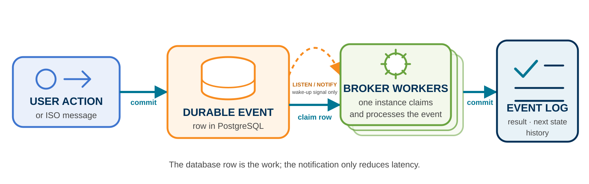
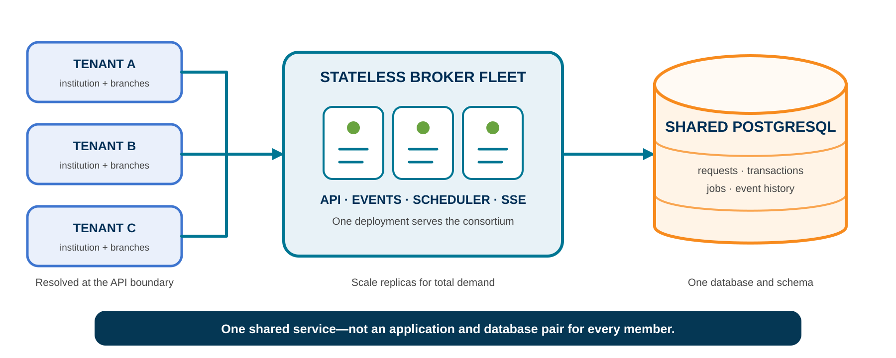
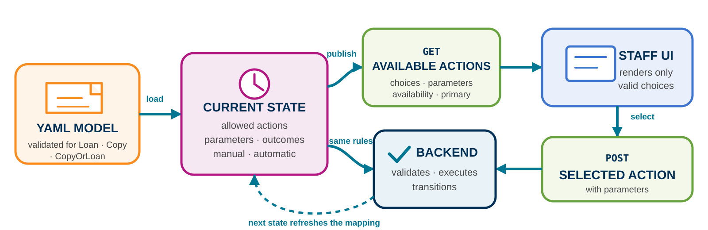
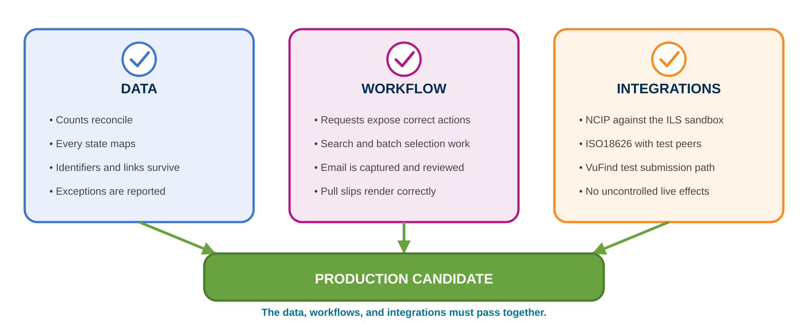
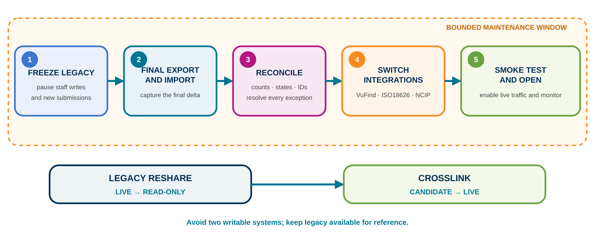

# From CrossLink broker to CrossLink platform

| WOLFcon 2025 | WOLFcon 2026 |
|---|---|
| Standards-based ILL broker | Complete ILL workflow platform |
| Connect external peers | Native borrowing and lending |
| Route and observe transactions | Model and operate the lifecycle |

New: Patron Requests API · NCIP · explicit state model · live UI events · scheduling

::: notes
Last year we presented CrossLink as a standards-based broker. This year the broker has become the foundation for ReShare's own borrowing and lending workflows. The key addition is not simply another API; workflow itself is now explicit.
:::

# ReShare proved community-owned resource sharing works

- Community-owned and ILS-neutral
- Production workflows shaped by practitioners
- Integrations across diverse library systems
- A wealth of knowledge about the happy path—and every exception

> We are replacing an implementation, not the product.

::: notes
Start from continuity and success. Legacy ReShare proved that the community service model works. The redesign preserves that accumulated service knowledge.
:::

# Why the backend needed a successor

- The original implementation had substantial app and persistence framework overhead
- Separate app and DB deployments for every tenant multiplied into hundreds of instances
- External Kafka-based messaging added infrastructure to deploy, monitor, and maintain
- Workflow progress still depended on a non-transactional handoff between database state and Kafka events
- Workflow definition spread across domain logic, status handlers, protocols, and events
- Workflow changes required code tracing, releases, and cross-integration testing
- Vendor behavior accumulated in the core application

::: notes
The original choices accelerated early delivery and got ReShare into production. FOLIO and Okapi provided useful modularity. The operational issue highlighted here is more specific: the tenancy architecture multiplied application and database deployments across individual tenants, while Kafka and ZooKeeper added services that also had to be deployed and maintained. Database commits and Kafka publication were not one atomic operation, creating failure windows in which state and pending work could diverge. CrossLink instead carries tenant ownership inside one shared deployment and records workflow events durably in PostgreSQL. Production experience gave us clearer requirements for a smaller successor.
:::

# Requirements before technology

:::::::::::::: {.columns}
::: {.column width="48%"}
## Preserve

- ILS/LSP neutrality
- First class ISO 18626 and NCIP
- Borrowing and lending workflows
- Consortial policy and supplier selection
- Multi-tenant operation
:::
::: {.column width="48%"}
## Improve

- Small operational footprint
- Explicit, inspectable workflows
- Clear adapter boundaries and a rich, observable API
- Complete transaction visibility
- Safe, staged migration
:::
::::::::::::::

::: notes
These requirements came before the technology choices. The goal was not a rewrite for its own sake: preserve the service contract while making the platform much easier to operate and evolve.
:::

# System at a glance

{width=76%}

::: notes
Internal clients use JSON and Server-Sent Events. External ILL peers use ISO 18626. ILS integration uses NCIP. Catalog and directory services remain replaceable dependencies. Do not explain every box. Introduce the center of gravity: a request changes through a state model, and meaningful changes become events.
:::

# Step 1: a request enters

:::::::::::::: {.columns}
::: {.column width="61%"}
{width=100%}
:::
::: {.column width="35%"}
- Staff UI → OpenAPI JSON
- Browser updates → SSE
- External ILL → ISO 18626
- One observable transaction
:::
::::::::::::::

::: notes
Native ReShare requests and brokered third-party requests share infrastructure without pretending their interfaces are identical. Both become observable transactions inside the broker.
:::

# One request, two complementary views

:::::::::::::: {.columns}
::: {.column width="47%"}
## Patron Request

- Practitioner-facing lifecycle
- Borrowing or lending perspective
- Current state and available actions
- Items, notifications, and attention flags
- Search, filtering, paging, and batch selection

:::
::: {.column width="47%"}
## ILL Transaction

- ISO 18626 message exchange
- Supplier location and rota decisions
- Adapter calls and protocol details
- Complete technical event history
:::
::::::::::::::

::: {.api-observability-banner}
**A hyperlinked API surface connects each request to its transaction, protocol activity, and durable event history—complete observability from intent to outcome.**
:::

::: notes
Every native Patron Request is backed by an ILL transaction. Staff work with a workflow-oriented resource; implementers and support teams can follow the underlying protocol, routing, and integration trace. The API links the two resources rather than collapsing them into one overloaded object.
:::

# Step 2: prepare and source

:::::::::::::: {.columns}
::: {.column width="61%"}
{width=100%}
:::
::: {.column width="35%"}
- Resolve institutions and policy
- Locate and rank suppliers
- Check real-time availability
- Swap discovery implementations
- Fail open on adapter errors
:::
::::::::::::::

::: notes
Directory information and consortium policy guide supplier resolution. Discovery is a capability behind an interface, not a permanent dependency on one catalog. A temporary adapter failure is recorded but is not treated as confirmed unavailability.
:::

# Step 3: contracts at the boundaries

:::::::::::::: {.columns}
::: {.column width="47%"}
## Use open interfaces

- **ISO 18626** — peer ILL messages
- **NCIP** — patron and circulation operations
- **SRU / Z39.50** — discovery and availability
- **OpenAPI JSON** — internal clients and staff UI
:::
::: {.column width="47%"}
## Keep them compliant

- Schema-generated protocol models (xsd2go.xsl)
- Generated API types and routing contracts (OpenAPI codegen)
- Vendor shims and `illmock` integration tests
:::
::::::::::::::

::: notes
Standards define the edges. OpenAPI, protocol schemas, and SQL generate much of the boundary code so handwritten code can concentrate on workflow decisions. Real implementations still differ, so a dedicated compatibility layer isolates known vendor behavior. The mock service and integration suites exercise the same contracts used in production.
:::

# Step 4: workflow events are durable

{width=96%}

- Work survives application restarts and failures remain visible
- Multiple instances can safely compete for work without an external message queue
- Retries, scheduling, and batch processing use the same internal core
- Typed, explicit SQL access (sqlc)—without an ORM

::: notes
PostgreSQL is both the durable source of truth and the lightweight wake-up mechanism. A notification is not the work itself: workers claim durable event rows before processing them. The request is not a mutable black box; the history explains how it reached its current state. Scheduled work includes recovery for tasks left running after interruption.
:::

# A small core supports a complete platform

:::::::::::::: {.columns}
::: {.column width="47%"}
## Lightweight core runtime

- One Go service around durable state
- PostgreSQL as the only infrastruture dependency
- No Kafka cluster for core messaging
- Custom event bus implementation
- Stateless Kubernets/Helm deployment and health endpoints
- Packaged database migrations and rolling updates
:::
::: {.column width="47%"}
## Main features built on the shared core

- Workflow execution
- Scheduler and batch actions
- Request aging and retries
- Notifications and email templates
- Pull slips and document delivery
- Live UI updates through SSE
:::
::::::::::::::

::: notes
Multi-tenant ownership is resolved at the API boundary and carried through request operations. The next slide supplies measured local proof points for image size, startup time, memory, and core runtime components. Production capacity and horizontal scaling remain separate measurements.
:::

# One deployment, many tenants

{width=96%}

::: notes
Tenant identity is part of the request and authorization context, not the deployment topology. In an Okapi request, the tenant resolver maps the tenant to the institution symbols it owns, including branches. APIs and operational features authorize access against those symbols. Patron requests record tenant and requester/supplier identity; templates, pull slips, and scheduled work carry an owner; workflow events remain linked to the scoped request and transaction. All institutions share the broker fleet, tables, migrations, and PostgreSQL deployment. Typed sqlc access keeps database code explicit, while isolation itself comes from tenant resolution, ownership checks, and owner-scoped operations.
:::

# Lightweight is measurable

| Measure | New broker | mod-rs 2.13 | Difference |
|---|---:|---:|---:|
| Container image | 35.6 MB | 246.0 MB | **6.9× smaller** |
| Slowest cold start—3 runs | 0.667 s | 37.006 s | **55× faster** |
| Service process RSS at 60 s | 39.2 MiB | 992 MiB | **25× lower** |
| App working set | 19.7 MiB | 1,509.2 MiB | **77× lower** |
| Core runtime pieces | 2 | 5 | **3 fewer** |

Native ARM and a 2 GiB app limit. Legacy app tier includes Kafka + ZooKeeper; PostgreSQL and Okapi excluded.

::: notes
These are local comparative measurements, not production capacity figures. The startup row deliberately uses the slowest of three successful runs for both applications: 0.667 seconds for the new broker and 37.006 seconds for mod-rs 2.13. The official mod-rs image is x86-only, so its unchanged platform-neutral JAR was run on native ARM Java 11. The app-working-set row was measured with the services running together: 19.69 MiB for the broker, versus approximately 1,509.2 MiB for mod-rs, Kafka, and ZooKeeper. PostgreSQL and Okapi are excluded from that row. The historical Kafka and ZooKeeper images are x86-only; the combined native measurement used a protocol-compatible Kafka 7.9 and ZooKeeper 3.9 baseline, so treat it as an operational-footprint estimate rather than an exact reconstruction of the historical deployment. Docker image sizes come from the same image metadata field, although the published mod-rs image is amd64 and the broker image is arm64.
:::

# A smaller maintenance surface

| Maintenance measure | New broker | mod-rs 2.13 | Difference |
|---|---:|---:|---:|
| Tracked core source files | 82 | 297 | **72% fewer** |
| Core production source | 20,239 lines | 31,000 lines | **35% less** |
| Direct declared dependencies | 28 | 67 | **58% fewer** |
| Tracked test source files | 61 | 35 | **74% more** |
| Test source | 34,695 lines | 4,868 lines | **7.1× more** |

> The goal is not less code—it is easier maintenance and faster time to market for new features.

::: notes
Production counts exclude tests, generated code, and database migrations. Test counts include tracked `_test.go` files for the broker and tracked Groovy/Java test sources for mod-rs. They compare the current broker module with the mod-rs 2.13.0 release tag. Lines of code across Go and Groovy/Java are only engineering-volume indicators—not coverage, productivity, or quality scores. The architectural point is that protocol generation, typed database access, adapters, and the declarative workflow leave less handwritten application machinery to trace and maintain, while the new implementation carries substantially more executable test code.
:::

# Small does not mean simplistic

| Default state-model capability | Current model |
|---|---:|
| Workflow variants | Loan · Copy · CopyOrLoan |
| Perspectives | Borrower · Supplier |
| Workflow states | 42 |
| Distinct actions | 32 |
| Declared action outcomes | 69 |
| Distinct incoming events | 18 |

> The complexity is visible and validated—not scattered through the application.

::: notes
The measurements establish that the runtime is small; this table establishes that the workflow is still capable. The default model represents both sides of loan and copy workflows, including branches and exceptions. Repeated state names reflect states that apply differently by side or service type. Action outcomes are the declared outcome-to-next-state mappings in the current generated model.
:::

# Interoperability by design

:::::::::::::: {.columns}
::: {.column width="48%"}
## Transparent mode

- Requester sees the supplier
- Supplier changes remain visible
- Enables granular cancellation and local supply
:::
::: {.column width="48%"}
## Opaque mode

- Broker appears as a conventional peer
- Supports point-to-point assumptions
- Supplier context carried safely in messages
- Compatibility shims bridge real-world differences
:::
::::::::::::::

::: notes
The same broker can participate in mixed ecosystems. Confirm which ReShare, Alma/Rapido, ILLiad, and other production or tested integrations may be named in the final presentation.
:::

# The central change: workflow is a model

```yaml
- name: NEW
  side: REQUESTER
  initial: true
  primaryAction: validate-patron
  actions:
    - name: validate-patron
      trigger: auto
      transitions:
        success: VALIDATED
        review: INVALID_PATRON
```

One definition connects backend behavior, automation, and UI affordances.

::: notes
The workflow is no longer only an emergent property of application code. Today the unified default model covers Loan, Copy, and CopyOrLoan with separate requester and supplier views. The current repository has 42 state entries, but the exact count is better as speaker evidence than as the headline.
:::

# Anatomy of the state model

{width=94%}

::: notes
A state says what is true now. An action says what a person or automation may do. An incoming protocol event says what happened elsewhere. Outcomes map to permitted next states. Applicability rules allow parts of the model to differ by service type.
:::

# A borrowing request, step by step

{width=96%}

::: notes
The happy path remains easy to follow. The branches are explicit: invalid patrons pause for review, metadata that cannot be completed automatically enters NEEDS REVIEW, SENT hands the request to the common transaction flow for routing, and conditional supply becomes an explicit negotiation state.
:::

# From model to API to UI

{width=96%}

Example: `INVALID_PATRON` offers revalidate, skip validation, or close—not check out.

::: notes
This is where the model becomes product behavior. The API publishes the allowed actions, their parameters, availability, and which one is primary. Automatic actions are omitted from the manual choice list unless they fail and need intervention. The backend checks the same mapping when an action is submitted, so the UI and server do not maintain separate workflow rules.
:::

# Customizable with guardrails

:::::::::::::: {.columns}
::: {.column width="47%"}
## Shape the workflow

- Choose supported actions per state
- Make actions manual or automatic
- Map outcomes and incoming messages
- Apply behavior by service type
- Mark primary, editable, terminal, and attention states
:::
::: {.column width="47%"}
## Enforce the contract

- Publish supported capabilities
- Reject unknown actions and events
- Prevent requester/supplier crossovers
- Validate transitions and closing paths
- Check service-type consistency
:::
::::::::::::::

::: notes
Concrete examples include requiring or skipping patron validation, stopping for metadata review, automatically checking for duplicates, and using different fulfillment actions for loans and digital copies. The model is semantically versioned, generated, validated, and embedded. Administration and promotion of consortium models can evolve without changing the execution engine. Open questions include upgrades for in-flight requests and coexistence of multiple versions.
:::

# Demo: one request, every boundary

1. Create a borrowing request
2. Watch automatic preparation actions
3. Locate suppliers, check availability, and send
4. Receive `Unfilled` and advance the rota
5. Receive `Loaned` and update the UI through SSE
6. Perform an NCIP action and inspect the event history

::: notes
Prepare a complete recording, a known-good request ID, and captured event history as fallback. The live demo can still be attempted first.
:::

# Migration is rehearsed, not improvised

{width=96%}

::: notes
Start with a representative first cohort and give staff a migration rehearsal environment: real data, but isolated from live ILS, ISO 18626, discovery, and email effects. Import open and recently created requests with a dedicated migration path that restores their current state without replaying live workflow actions. Staff review the requests as operational work—not just rows in a database. Fix mappings, importer behavior, or configuration, reset the environment, and repeat from a clean import until the evidence passes.
:::

# Cutover is earned by three acceptance gates

{width=96%}

::: notes
Acceptance has three dimensions. Data must reconcile and retain its identifiers, links, and meaningful workflow state. Staff must be able to find requests, take the correct actions, use batch operations, review email, and produce pull slips. Integrations must be exercised safely: especially NCIP against an ILS sandbox, ISO 18626 with test peers, and the VuFind submission path. Only when all three pass do we have a production candidate.
:::

# Plan for a bounded maintenance window

{width=96%}

::: notes
We should not promise zero downtime because live submission and ILS connections must move between systems. Instead, plan a short, controlled maintenance window: freeze writes in legacy ReShare, capture and import the final delta, reconcile it, switch VuFind, ISO 18626, and NCIP, then smoke-test before reopening. Crosslink becomes the only writable system; legacy ReShare remains read-only for reference. Rehearsals make the duration and operational steps measurable before the real cutover.
:::

# Roadmap to production adoption

| Now | Next | Later |
|---|---|---|
| Core borrowing/lending workflow | Production UI and operational hardening | Governed custom state models |
| ISO 18626, NCIP, discovery | Migration and history tooling | Multiple active model versions |
| State model and event history | Pilot cohort and conformance testing | Broader service models |

::: notes
This is a structure, not yet a set of public commitments. Every roadmap item needs an agreed status, owner, and date before the final deck.
:::

# A platform that evolves with the service

- Open at the edges
- Explicit at the center
- Small enough to operate
- Flexible enough to evolve
- A migration path that protects continuity

> The next generation of ReShare makes the community's ILL workflow a first-class part of the platform.

::: notes
This is not simply a smaller backend. It preserves the community service model while making workflow visible, testable, and evolvable.
:::
